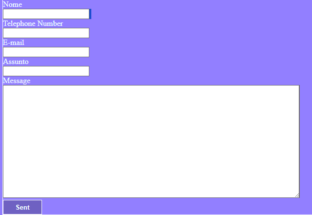

# Projeto - Formulario
 
Projeto criado como parte avaliativa da disciplina de Fundamentos de Desenvolvimento Web ministrada pelo professor Leonardo Rocha.
 
## Índice
* [Descrição](#descrição)
* [Tecnologias](#tecnologias)
* [Referências](#referências)
* [Autor(a)](#autora)
 
## Descrição
 
Um projeto para criar uma página para contatos.
 
 
## Tecnologias
 
* HTML5
* CSS3
* Git
* Github
 
## Códigos
 
 * CSS:
* background-color - Propriedade CSS que define cor de fundo de um elemento.
 
* padding - A propriedade padding define uma a distância entre o conteúdo de um elemento e suas bordas.
 
* height - A propriedade height do CSS determina a altura da área do conteúdo de um elemento.
 
* justify-content - A propriedade justify-content é usada para alinhar os elementos
 
* align-items - Alinha os itens do grupo dependendo do função que você inserir no comando, neste projeto usamos o "center".
 
* font family - A propriedade font-family do CSS permite que se faça uma lista de prioridades de familias de fontes e/ou nomes genéricos de famílias a serem especificados para um elemento selecionado.
 
* display - A propriedade display CSS define se um elemento é tratado como um bloco ou elemento inline e o layout usado para seus filhos, como layout de fluxo, grid ou flex.
 
* width - A propriedade CSS width determina a largura da área de conteúdo de um elemento. A área de conteúdo fica dentro do preenchimento, da borda, e da margem de um elemento.
 
* height - A propriedade height do CSS determina a altura da área do conteúdo de um elemento. A área de conteúdo consiste no padding, margin e border do elemento.
 
* border-radius - A propriedade CSS3 border-radius destina-se a definir bordas arredondadas.
 
* box-shadow - O box-shadow é uma propriedade do CSS, é utilizado para adicionar efeitos de sombra em volta de um elemento. Você pode especificar mais de um efeito, os separando com virgulas.
 
* text-aling - A propriedade CSS text-align descreve como conteúdo inline, como texto, é alinhado no elemento pai em bloco. text-align não controla o alinhamento de elementos em bloco, apenas o seu conteúdo inline.

* HTML:
* label - A propriedade label representa uma legenda para um item em uma interface de usuário. Ele pode estar associado com um elemento de controle, colocando este dentro do elemento label , ou usando o atributo for . Tal controle é chamado o controle etiquetado do elemento etiqueta.

* input - input É um campo para que o usuário ou usuária possa inserir algum texto, data, número, cor, etc. possui como principais atributos type, que recebe como valor o tipo do input.

* text-area - O elemento HTML textarea representa um controle de edição para uma caixa de texto, útil quando você quer permitir ao usuário informar um texto extenso em formato livre, como um comentário ou formulário de retorno.

* button - O Elemento HTML button representa um botão clicável. Categorias de conteúdo Conteúdo de fluxo, conteúdo fraseado, Conteúdo iterativo, listado, rotulável, e elemento enviável associado a formulário, conteúdo palpável.

* form - A tag form indica que estamos iniciando um formulário, recebe como principais atributos method que recebe como valor o método http que esse formulário irá executar (get, post) e action que especifica para onde enviar os dados do formulário quando um formulário é enviado.
 
## Resultado Final
 

 
## Referências
 
* [Alura](https://www.alura.com.br/artigos/escrever-bom-readme) - Como escrever um README incrivel no seu gitHub
* [MDN](https://developer.mozilla.org/pt-BR/) - Usado para uma pesquisa aprofundada dos itens de CSS e HTML.
* [AleloWiki](https://alelowiki.cenargen.embrapa.br/index.php/P%C3%A1gina_principal) - Site usado na pesquisa do código CSS "justify-content".
* [Maujor](https://maujor.com/) - Site usado na pesquisa do código CSS "border-radius".
 
## Autor(a)
 
Projeto desenvolvido pelo aluno:
* Miguel Gonçalves Reis